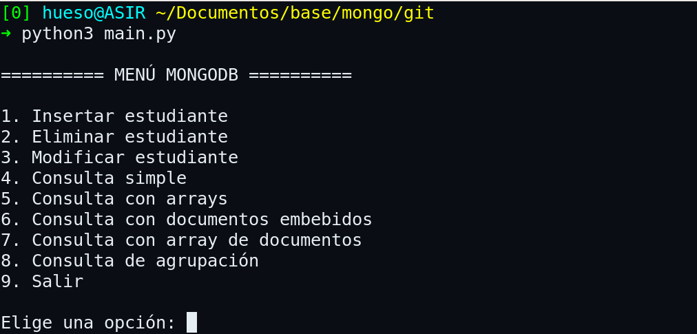
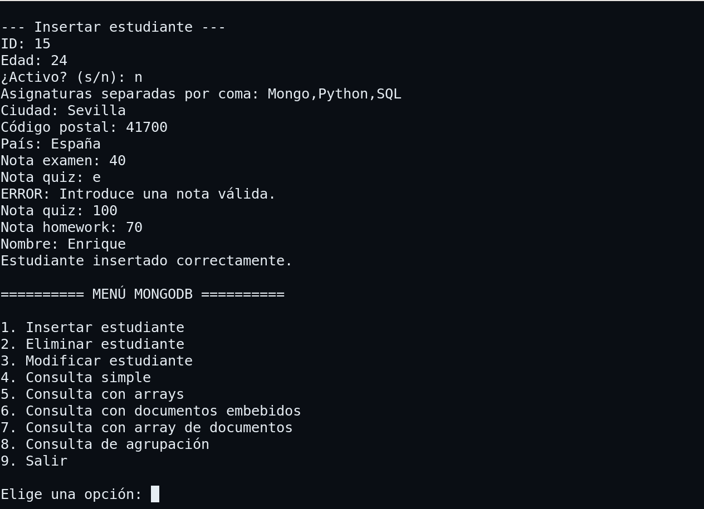
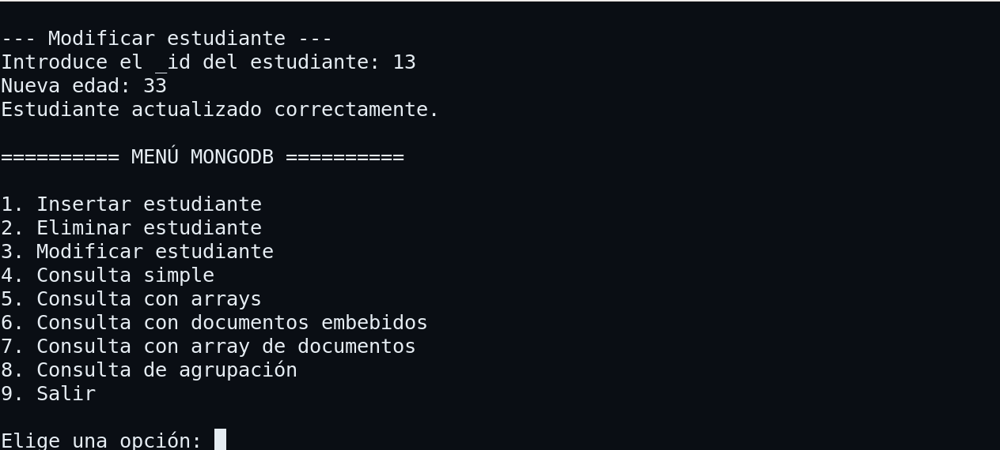
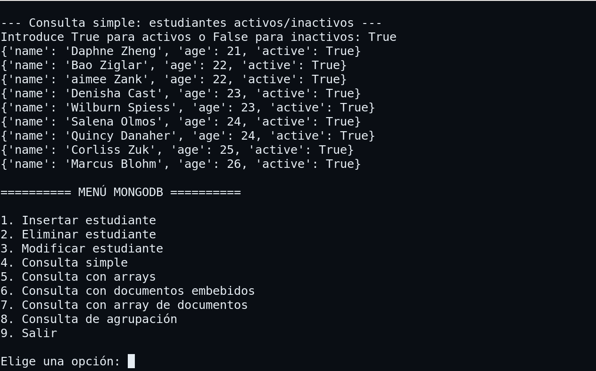
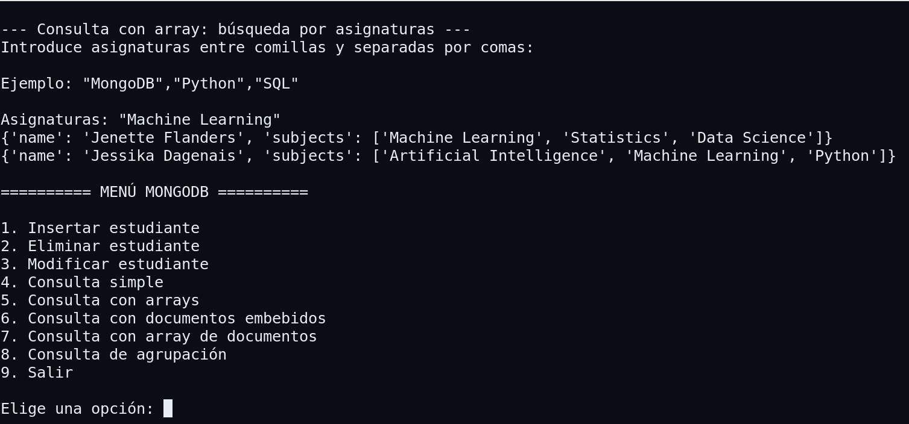
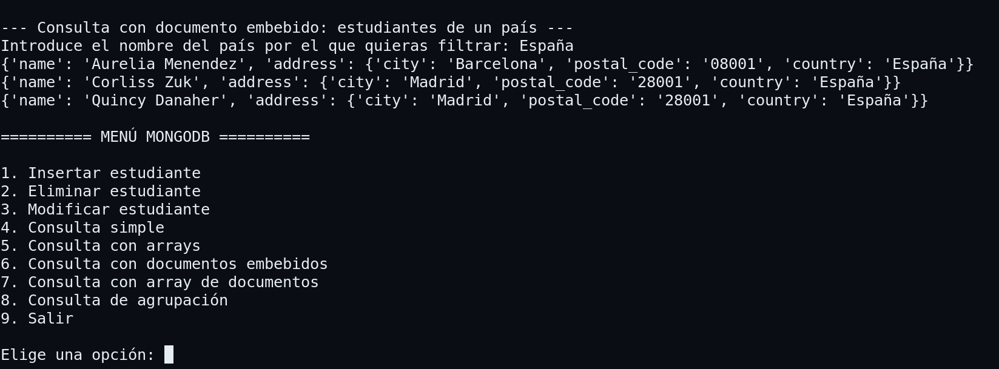
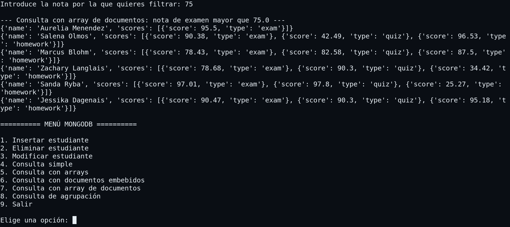
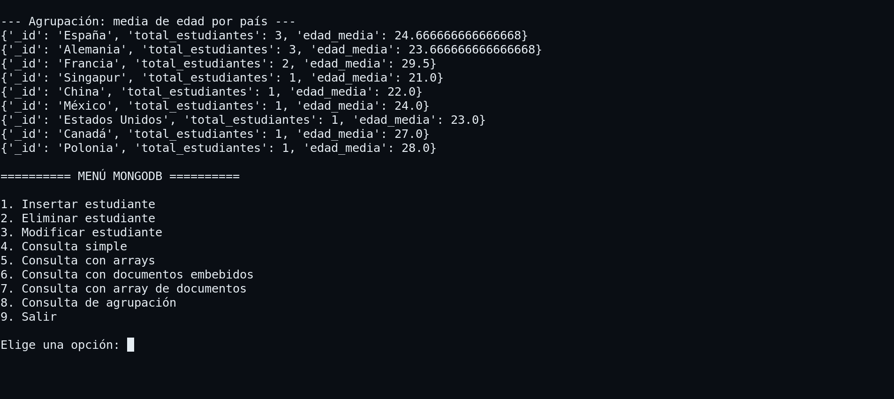
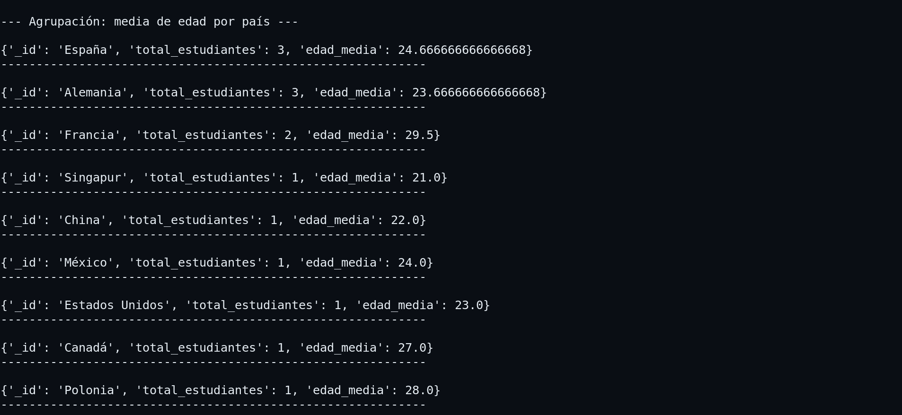

# Mongo

# Proyecto MongoDB con Python

Proyecto para practicar operaciones CRUD sobre una base de datos MongoDB utilizando Python y PyMongo.

El repositorio contiene un programa dividido en dos archivos principales: `main.py`, encargado del menú principal, y `mongo_def.py`, 
donde se encuentran las funciones de conexión y operaciones sobre MongoDB. También incluye el archivo `students_valido.json` con 
los documentos utilizados para importar la colección inicial.

## Programa

### Menú

Menú del programa

### Inserción de documento

Función de insertar documento

### Modificación de documento

Función de modificar documento

### Consulta simple

Función de consulta simple

### Consulta con arrays

Función de consulta con arrays

### Consulta con documentos embebidos

Función de consulta con documentos embebidos

### Consulta con array de documentos

Función de consulta con array de documentos 

### Consulta de agrupación

Función de consulta con array de documentos 

### Pprint

El uso de pprint ayuda a mejorar la visualización de todas las salidas 

## Estructura del repositorio

mongo/
├── README.md
├── main.py
├── mongo_def.py
└── students_valido.json

